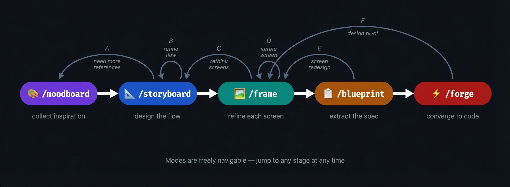
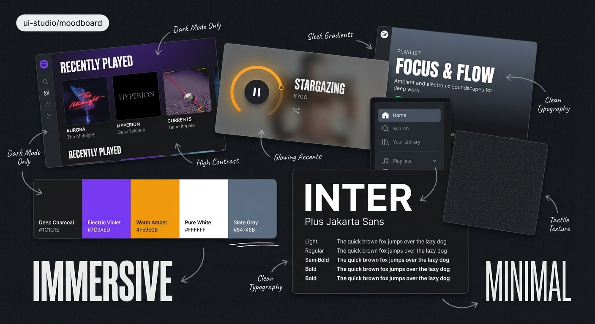
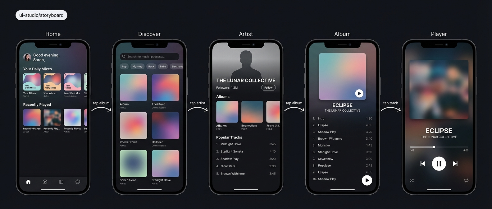
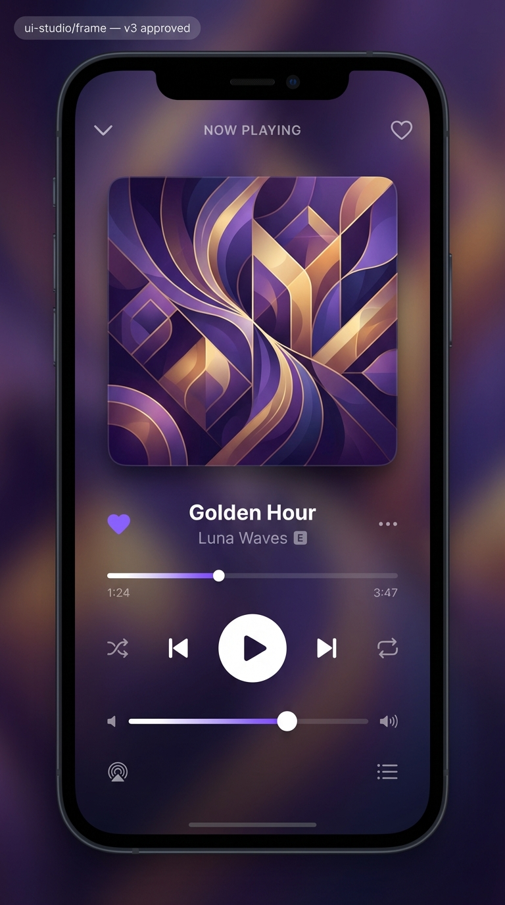
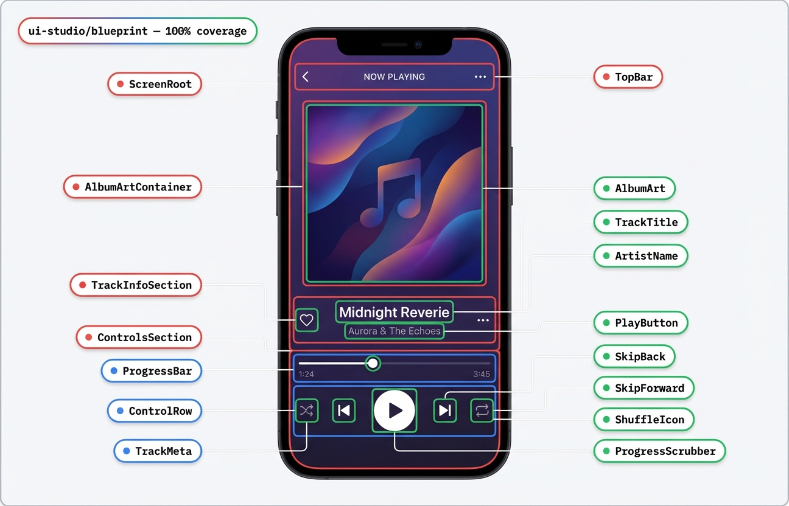
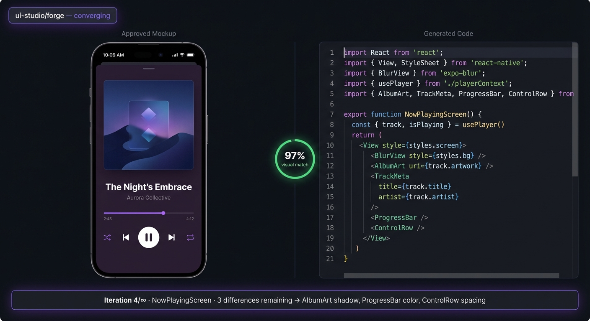

# UI Studio

**Design to code. Five modes. One pipeline.**

```bash
amplifier run --bundle git+https://github.com/kenotron-ms/amplifier-bundle-ui-studio@main
```

---

<p align="center">
  
</p>
<p align="center"><em>Five modes. Forward progress and free backtracking. The statechart tracks where you are.</em></p>

---

## The Pipeline

UI Studio turns visual intent into production code through five slash-command modes. Each mode produces artifacts the next mode consumes — but you're never locked in. Jump back to `/moodboard` mid-storyboard. Bounce between `/frame` and `/storyboard`. The statechart remembers everything.

---

### `/moodboard`



Drop in screenshots, photos, color palettes, text snippets — anything that captures the vibe. The agent synthesizes a visual collage and an aesthetic brief that carries forward into storyboarding.

- **Visual signal, not keywords.** The collage becomes a reference image for screen generation. Your inspiration directly shapes the output.
- **Additive.** Come back anytime to feed in new references. The brief updates.

---

### `/storyboard`



Describe your app. Get a complete multi-screen UX flow generated in one shot — all screens at once for visual consistency. Iterate the flow until it clicks, then approve it.

- **Simultaneous generation.** All screens render together. No drift between the first screen and the last.
- **Statechart output.** Captures every screen, every transition, and every trigger (tap, swipe, submit). Forge uses this to wire up real navigation.

---

### `/frame`



Pick a screen from the storyboard. Refine it to pixel-level fidelity through a human-in-the-loop convergence loop. You're the judge — the agent proposes, you approve or redirect.

- **Human taste drives convergence.** No automated quality gate replaces your eye. You say when it's done.
- **Per-screen focus.** Work on one screen at a time with full attention. Return to the storyboard to pick the next.

---

### `/blueprint`



Fully automated. Takes the approved screen and extracts a complete component spec: design tokens, spatial relationships, asset inventory. Runs autonomously until every pixel belongs to a component.

- **Containment model.** No pixel without a container. The agent self-judges coverage and loops until it hits 100%.
- **Machine-readable output.** Component hierarchy, exact token values, font specs, spacing — everything forge needs to write code.

---

### `/forge`



Fully automated. Generates code from blueprints, captures a screenshot, compares it against the approved mockup using visual AI, then iterates. Code converges to the design — not the other way around.

- **Screenshot comparison loop.** Render, capture, diff, fix. Repeats until visual match hits **95%+**.
- **Design-faithful.** The mockup is ground truth. Code adapts to match it, pixel by pixel.

---

## Quickstart

**1. Set the mood**
```
/moodboard
> Here are 3 screenshots from apps I love [attach images]
> I want: dark theme, generous whitespace, SF Pro typography
```

**2. Map the flow**
```
/storyboard
> A task management app with: inbox, project board, and detail view
> Navigation: tab bar between inbox and projects, tap task to open detail
```

**3. Refine the screen**
```
/frame
> Let's refine the project board screen
> Make the cards more compact, add subtle shadows
```

**4. Extract the spec**
```
/blueprint
> Blueprint the approved project board screen
```

**5. Ship the code**
```
/forge
> Generate code for the project board
```

---

## Prerequisites

| Dependency | Purpose |
|---|---|
| [tool-nano-banana](https://github.com/kenotron-ms/amplifier-module-tool-nano-banana) | VLM-powered image analysis and generation |
| Playwright | Browser automation for screenshot capture |
| ImageMagick | Image diff for forge's comparison loop |
| `GOOGLE_API_KEY` | Google Fonts API access for font matching |

---

## Composable Usage

Include UI Studio as a behavior layer in another bundle:

```yaml
includes:
  - bundle: git+https://github.com/kenotron-ms/amplifier-bundle-ui-studio@main
    behavior: ui-studio
```
